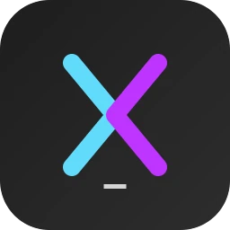

  
  <h1>Injecode</h1>

---

**Injecode** 是一款专为 AI 辅助开发设计的高效上下文编排与代码注入套件。它通过自动化的逻辑上下文构建与精准的代码应用，架起了本地/远程代码库与大语言模型（LLM）之间的桥梁。

访问 [官方网站](http://zzlovett.top) 了解更多信息。

### 从这里开始

*   **下载**：前往 [官方网站](http://zzlovett.top) 下载最新的 Windows 版本。
*   **核心特性**：提供逻辑代码分组、Token 优化的上下文提取以及确定性代码注入（Protocol 3），旨在简化您的 AI 开发工作流。
*   **支持**：关于模型集成与 API 服务，请访问我们的 [AI 网关](https://ai.zzlovett.top)。

---

**Injecode** is a high-efficiency context assembly and code injection suite for AI-assisted development. It bridges the gap between local/remote codebases and Large Language Models (LLMs) by automating logical context assembly and precise code application.

Visit the [Official Website](http://zzlovett.top) for more information.

### Where to start

*   **Download**: Go to the [Official Website](http://zzlovett.top) to download the latest release for Windows.
*   **Features**: Features logical code grouping, token-optimized context extraction, and deterministic code injection (Protocol 3) to streamline your AI development workflow.
*   **Support**: For model integration and API services, visit our [AI Gateway](https://ai.zzlovett.top).